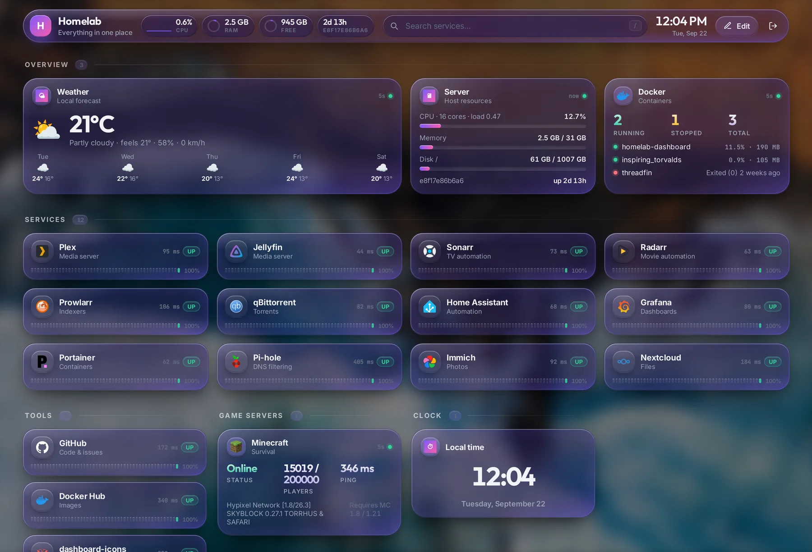
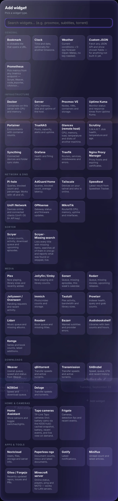
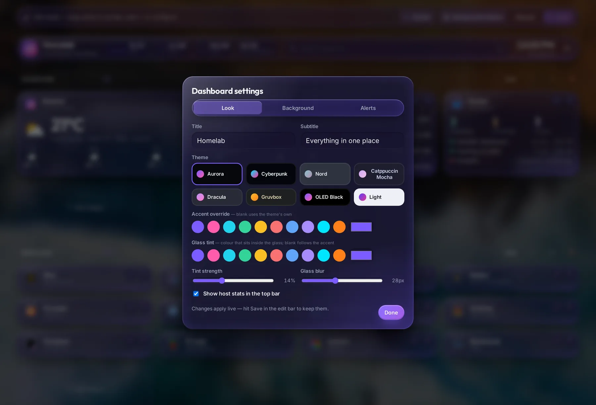
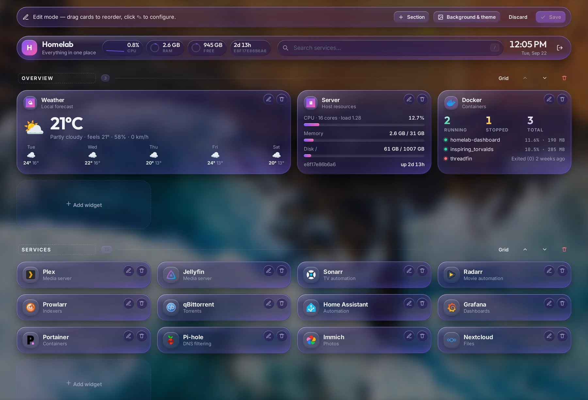
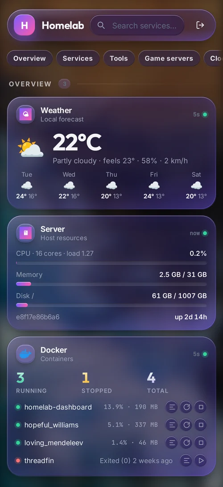
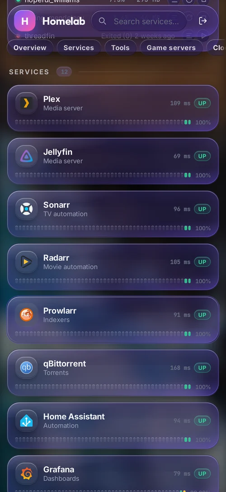
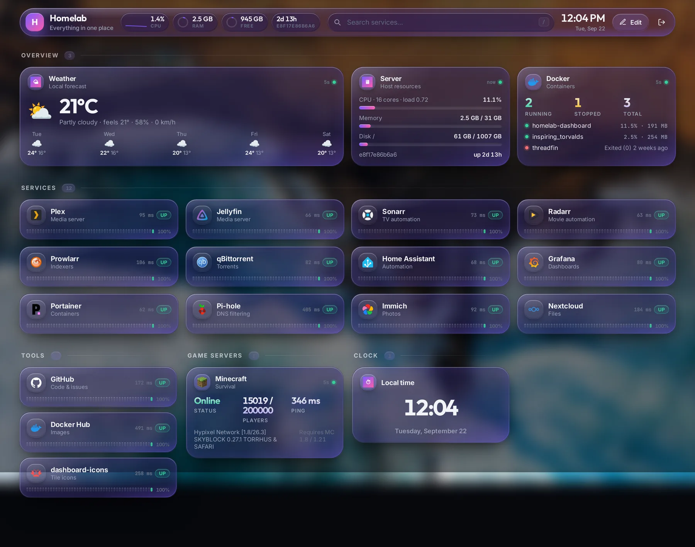

<div align="center">

# Homelab Dashboard

**One login, one container, every service in your homelab — live.**

[](https://github.com/CrypticzXI/Homelab-Dashboard/actions/workflows/ci.yml)
[](https://github.com/CrypticzXI/Homelab-Dashboard/actions/workflows/release.yml)
[](LICENSE)



[**Widgets**](docs/widgets.md) · [**Installation**](docs/install.md) · [**Configuration**](docs/configuration.md) · [**Cameras**](docs/cameras.md) · [**Development**](docs/development.md)

</div>

---

## Why this dashboard

Most homelab dashboards are a grid of bookmarks that can't tell you whether anything is actually working. The rest are monitoring stacks you have to run, feed and babysit. This sits in between.

**Bookmarks that know if they're alive.** Every tile is pinged from the server each minute and shows latency, an UP/DOWN pill and a 24-hour uptime strip. When something goes down you get a banner — and a Discord / ntfy / Slack / Telegram message if you want one.

**Real widgets, not iframes.** 50+ integrations read their APIs directly: Docker containers with CPU and memory, Proxmox guests, Plex streams, *arr queues, Pi-hole blocks, disk health, camera events. Add one, paste a key, hit **Test connection**.

**Your keys stay on your server.** API tokens live in `data/config.json` and are redacted from every response — the browser only ever sees `__SECRET__` and talks to this app's own API. Nothing is proxied through a third party.

**One container, no sprawl.** nginx, the API, a Tapo camera bridge and go2rtc all run in a single image. One `./install.sh` on the server and you're done.

**Edit it in the browser.** Desktop-only edit mode: drag cards around, resize them, group them into grid or column sections, upload a wallpaper, pick a theme. Nothing is configured in YAML unless you want it to be.

**Actually usable on a phone.** Single column, sticky section jump bar, installable to the home screen — not just a shrunken desktop layout.

---

## A look around

<table>
<tr>
<td width="50%"></td>
<td width="50%"></td>
</tr>
<tr>
<td><b>50+ widgets</b>, grouped and searchable, with a connection test before you save. <a href="docs/widgets.md">See them all →</a></td>
<td><b>Eight themes</b> plus Liquid Glass tint, strength and blur controls, and wallpapers from Bing, a URL or an upload.</td>
</tr>
<tr>
<td></td>
<td align="center"> </td>
</tr>
<tr>
<td><b>Edit mode</b> — drag to reorder, resize, add sections, all in the browser.</td>
<td><b>Mobile</b> — one column, jump bar, add to home screen.</td>
</tr>
</table>

---

## Quick start

```bash
mkdir -p ~/homelab-dashboard && cd ~/homelab-dashboard
curl -fsSLO https://raw.githubusercontent.com/CrypticzXI/Homelab-Dashboard/main/docker-compose.yml
curl -fsSL https://raw.githubusercontent.com/CrypticzXI/Homelab-Dashboard/main/.env.example -o .env
nano .env                 # set DASH_PASSWORD at least
docker compose up -d      # or: podman compose up -d
```

That pulls the published image — multi-arch, so it works on a Pi too:

```
ghcr.io/crypticzxi/homelab-dashboard:latest
```

Then open `http://<server>:8080`, sign in and click **Edit**.

Prefer a guided setup, `docker run`, or building from source? [**Installation →**](docs/install.md)

---

## What's included

| | |
|---|---|
| **Dashboard** | Login-protected · grid & column sections · drag-and-drop · live search (`/`) · 8 themes · Liquid Glass UI · wallpapers · PWA |
| **Monitoring** | Per-bookmark ping with 24h uptime history · down banner · Discord / Slack / ntfy / Telegram / webhook alerts · host CPU, RAM and disk in the top bar |
| **Containers** | Docker & Podman stats, optional start / stop / restart and a live log viewer |
| **Media** | Plex · Jellyfin · Tautulli · Scryer · Weaver · Sonarr · Radarr · Lidarr · Readarr · Prowlarr · Bazarr · Jellyseerr · Immich · Audiobookshelf · Komga |
| **Infrastructure** | Proxmox · Portainer · TrueNAS · Glances · Scrutiny · Syncthing · Grafana · Traefik · NPM · Uptime Kuma · Prometheus |
| **Network** | Pi-hole · AdGuard · Tailscale · UniFi · OPNsense · MikroTik · Speedtest |
| **Home** | Home Assistant with working toggles · Frigate · [Tapo cameras](docs/cameras.md) with live view and event photos |
| **Anything else** | A Custom JSON widget and a Prometheus widget for services without a dedicated one |

[**Full widget reference →**](docs/widgets.md)

---

## Cameras worth a mention



TP-Link Tapo support is built for battery cameras rather than bolted on:

- live view only while you're watching, so the camera sleeps the rest of the time
- the server contacts a camera **at most once every 10 minutes**
- a frame is captured when a new detection appears and kept as the event's photo
- event timeline with detection types, battery %, charging state

[**Camera guide →**](docs/cameras.md)

<br clear="right">

---

## Documentation

| Guide | What's in it |
|---|---|
| [**Widgets**](docs/widgets.md) | Every widget type, what it needs, and notes on the clever ones, I've not tested all of them (they SHOULD work, if not leave a github issue) |
| [**Installation**](docs/install.md) | Installer, GHCR image, `docker run`, boot start, updating, troubleshooting |
| [**Configuration**](docs/configuration.md) | Environment variables, sockets, themes, alerts, HTTPS, backup |
| [**Cameras**](docs/cameras.md) | Tapo setup, the Third-Party Compatibility switch, battery behaviour |
| [**Development**](docs/development.md) | Architecture, running locally, adding a widget, CI |

## Security

- Widget secrets never reach the browser; the config API redacts them and restores them on save.
- `/go2rtc/` is proxied only for signed-in users, and only its playback endpoints — its stream list would expose camera credentials.
- Container controls and Home Assistant toggles are opt-in per widget; the API refuses them otherwise.
- Single-user by design. Put a reverse proxy and HTTPS in front before exposing it anywhere.

## License

[GPL-3.0](LICENSE)
