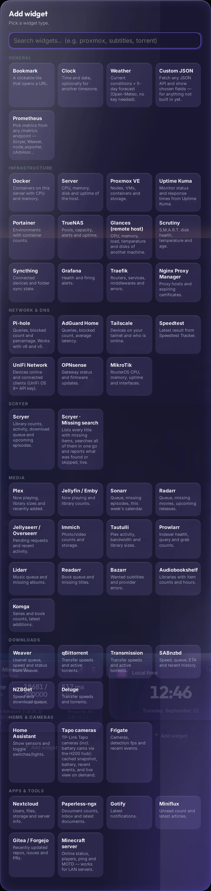

# Widgets

[← back to the README](../README.md) · [Installation](install.md) · [Configuration](configuration.md) · [Cameras](cameras.md) · [Development](development.md)

Add widgets in **Edit → + Add widget**. The picker is grouped and searchable. Every data widget has a **Test connection** button, and each field says where to find its token. Fields marked as secrets are stored on the server and never sent back to the browser.

<b>The whole catalogue in one picture</b>

## All widget types

### General

| Widget | Needs | Shows |
|---|---|---|
| **Bookmark** | URL | Clickable tile with a logo, ping latency, up/down and a 24h uptime bar. GitHub repo URLs also show stars / issues / commits |
| **Clock** | – | Time and date, optionally in another timezone |
| **Weather** | latitude, longitude | Current conditions and a 5-day forecast (Open-Meteo, no key) |
| **Custom JSON** | endpoint (+ headers) | Any values from any JSON API, picked with dot/bracket paths |
| **Prometheus** | `/metrics` URL (+ auth header) | Any metrics, with label filters, aggregation and formatting |

### Infrastructure

| Widget | Needs | Shows |
|---|---|---|
| **Docker** | container socket | Running/stopped counts, per-container CPU + memory, optional controls and logs |
| **Server** | – | Host CPU, memory, disks, uptime |
| **Proxmox** | URL + API token | Nodes with CPU/RAM, VMs and LXC, storage |
| **Uptime Kuma** | URL + API key | Monitors with status, response time, expiring certs |
| **Portainer** | URL + access token | Environments with container and stack counts |
| **TrueNAS** | URL + API key | Pools with capacity and health, alerts, uptime |
| **Glances** | URL of another host | That machine's CPU, memory, load, temperature, disks |
| **Scrutiny** | URL | S.M.A.R.T. status, temperature and age per disk |
| **Syncthing** | URL + API key | Connected devices, folder state, bytes to sync |
| **Grafana** | URL + service-account token | Health and firing alerts |
| **Traefik** | API URL | Routers, services, middlewares, errors |
| **Nginx Proxy Manager** | URL + email/password | Proxy hosts and certificates expiring within 14 days |

### Network & DNS

| Widget | Needs | Shows |
|---|---|---|
| **Pi-hole** | URL + password (v6) or token (v5) | Queries, blocked count and percentage, clients |
| **AdGuard Home** | URL + user/pass | Queries, blocked %, average latency |
| **Tailscale** | API access token | Devices, online/offline, updates available |
| **Speedtest Tracker** | URL (+ token) | Latest download / upload / ping |
| **UniFi Network** | console URL + API key (UniFi OS 9+) | Devices online, client counts |
| **OPNsense** | URL + API key/secret | Gateway status, firmware updates |
| **MikroTik** | URL + user/pass | RouterOS CPU, memory, uptime, interfaces |

### Media

| Widget | Needs | Shows |
|---|---|---|
| **Plex** | URL + `X-Plex-Token` | Now playing, library counts, recently added posters (proxied, token stays server-side) |
| **Jellyfin / Emby** | URL + API key | Now playing with transcode state, library counts |
| **Tautulli** | URL + API key | Streams, bandwidth, library sizes |
| **Scryer** | URL + API key | Library counts, 24h activity, queue, upcoming episodes, storage and client/indexer health |
| **Scryer missing search** | URL + API key | Titles with missing items + mass search with a live report |
| **Sonarr / Radarr** | URL + API key | Queue with progress, missing count, this week's calendar |
| **Lidarr / Readarr** | URL + API key | Queue and missing counts |
| **Prowlarr** | URL + API key | Indexer stats, query/grab counts, health |
| **Bazarr** | URL + API key | Wanted subtitles and provider errors |
| **Jellyseerr / Overseerr** | URL + API key | Request counts and recent requests |
| **Immich** | URL + API key | Photo/video counts, storage |
| **Audiobookshelf** | URL + API token | Libraries with item counts and hours |
| **Komga** | URL + API key | Series and book counts, latest additions |

### Downloads

| Widget | Needs | Shows |
|---|---|---|
| **Weaver** | URL + API key | Speed, queue with progress and ETA, disk space, bandwidth cap |
| **qBittorrent** | URL + user/pass | Speeds, leeching/seeding counts, active torrents |
| **Transmission** | URL (+ user/pass) | As above, via RPC |
| **Deluge** | URL + web password | As above |
| **SABnzbd** | URL + API key | Speed, queue, ETA, recent history |
| **NZBGet** | URL (+ user/pass) | Speed and queue |

### Home & cameras

| Widget | Needs | Shows |
|---|---|---|
| **Home Assistant** | URL + long-lived token + entity ids | Sensor values; switches, lights and fans get a real toggle |
| **Tapo cameras** | camera/hub IP + TP-Link ID | [See the camera guide →](cameras.md) |
| **Frigate** | URL | Cameras, detection fps, inference time, recent events |

### Apps & tools

| Widget | Needs | Shows |
|---|---|---|
| **Nextcloud** | URL + serverinfo token | Users, active users, files, free space |
| **Paperless-ngx** | URL + token | Document counts, inbox, latest documents |
| **Gotify** | URL + client token | Latest notifications with priority |
| **Miniflux** | URL + token | Unread count and latest articles |
| **Gitea / Forgejo** | URL + token | Recently updated repos, open issues and PRs |
| **Minecraft** | `host:port` | Online status, players, ping, MOTD — native server-list ping, works on a LAN |

## Notable widgets

### Bookmarks

Icons resolve from the [dashboard-icons](https://github.com/homarr-labs/dashboard-icons) set by name (`plex`, `proxmox`, `sonarr`, `github-light`), or you can give an emoji or an image URL.

- **Ping** is done from the server every 60 s; any HTTP answer (including a 401 login page) counts as up. The tile shows latency, an UP/DOWN pill and a 24-hour uptime strip.
- **Ping URL** can differ from the click-through URL — useful when the public hostname isn't reachable from the server.
- **GitHub repos**: point a bookmark at `github.com/owner/repo` and it shows ★ stars, open issues (excluding PRs) and total commits, cached for 15 minutes. Set `GITHUB_TOKEN` or a per-bookmark token for private repos and higher limits.

### Prometheus

Point it at any `/metrics` endpoint. **Test connection** lists the metric names it found (they autocomplete), then add rows:

| Field | Example |
|---|---|
| Label | `Root free` |
| Metric | `node_filesystem_avail_bytes` |
| Filter | `mountpoint="/"` — also `!=` and `=~` regex |
| Aggregation | sum / max / min / avg / count / first |
| Format | number, bytes, %, duration, "x ago", "in x", yes/no, raw |

Scryer needs `SCRYER_METRICS=1` in its `.env`; Weaver's endpoint is on by default. Both take their API key as a Bearer token.

### Scryer missing search

Lists every title with **monitored** missing items, grouped by title with per-episode detail (last search, indexer coverage, latest release decision). **Search all missing** triggers a mass acquisition search and reports live:

- progress `processed / total` and the title being searched
- a running **found / skipped / nothing** tally, derived by diffing each item's status and latest release decision against a snapshot taken when the job started
- titles with activity float to the top with green/amber counts

Unmonitored items (specials, when *monitor specials* is off) are excluded from both the counts and the search.

### Custom JSON

For anything without a dedicated widget. Give it an endpoint, optional headers (stored server-side), and a list of fields with dot/bracket paths like `data.items[0].count`.
